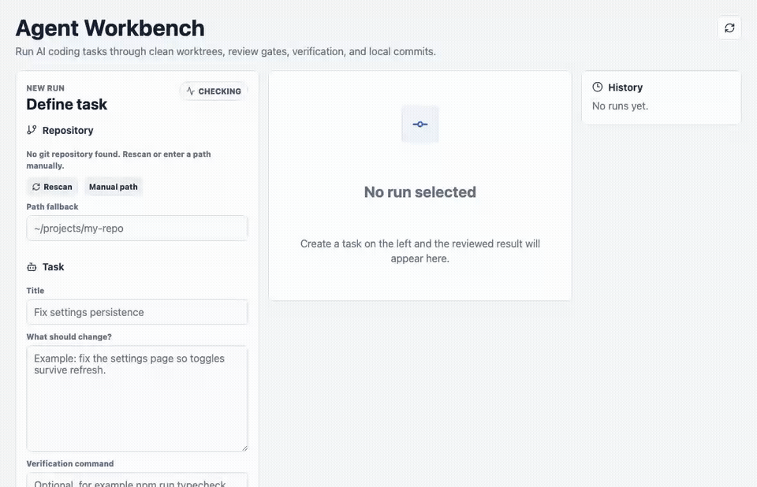
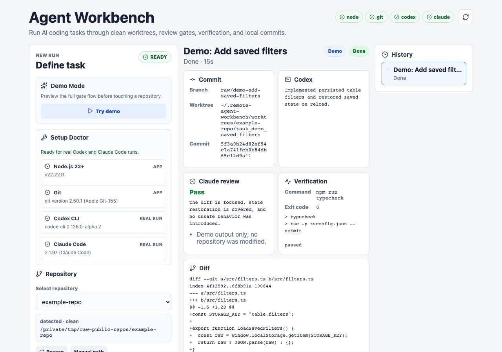
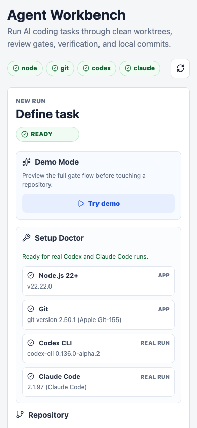

# Remote Agent Workbench

Remote Agent Workbench is a local-first control surface for running AI coding tasks with guardrails.

It creates an isolated git worktree, lets Codex implement the requested change, asks Claude Code to review the staged diff, runs verification, and only then creates a local commit.

## Demo



## Desktop



## Why

AI coding agents are useful, but the safest loop is not "ask an agent and hope." A better loop is:

1. Start from a clean repository.
2. Create an isolated worktree.
3. Let the coding agent make the smallest useful change.
4. Review the diff before running post-review checks.
5. Run verification.
6. Block commits when new unreviewed files appear after review.
7. Commit locally only after every gate passes.

Remote Agent Workbench turns that loop into a small local web app.

## What It Does

- discovers nearby git repositories and marks dirty repos
- rejects dirty target repositories before starting
- creates a temporary branch and git worktree per task
- runs Codex inside the isolated worktree
- stages the generated diff for review
- asks Claude Code for a structured pass/fail review
- blocks deploy-like or unsafe verification commands
- runs the selected verification command
- blocks commits if verification creates new unreviewed changes
- stores task state, logs, summaries, diffs, and commit hashes locally

## What It Does Not Do

- no git push
- no pull request creation
- no deployment
- no cloud queue
- no team account
- no hidden credential changes
- no automatic execution outside the selected worktree

V1 is intentionally local-first and conservative.

## Requirements

- macOS, Linux, or another Unix-like development machine
- Node.js 22+
- Git
- Codex CLI available as `codex`
- Claude Code CLI available as `claude`

The app still loads without Codex or Claude installed, but the health chips will show missing tools and real task execution will not pass.

## Quick Start

```bash
npm install
npm run dev
```

Open the printed local URL, usually:

```text
http://localhost:5177
```

Production-style run:

```bash
npm run build
npm start
```

## Verification

```bash
npm run verify
```

`verify` runs:

- TypeScript typecheck
- Vitest unit/integration tests
- public safety scan
- production build

## Configuration

Environment variables:

```bash
RAW_PORT=5177
RAW_HOST=127.0.0.1
RAW_WORK_ROOT=~/.remote-agent-workbench
RAW_GIT_BIN=git
RAW_CODEX_BIN=codex
RAW_CLAUDE_BIN=claude
RAW_TASK_TIMEOUT_MS=600000
RAW_WORKSPACE_ROOTS=~/projects,~/work
```

Use `RAW_WORKSPACE_ROOTS` to narrow repository discovery. Task creation still performs strict git validation.

## Core Safety Gates

The test suite covers the important failure modes:

- dirty target repositories are rejected
- missing test commands stop before commit
- failed Claude review stops before verification and commit
- failed verification stops before commit
- unsafe commands such as `git push` are blocked as verification commands
- generated files created after review are treated as unreviewed and block commit

## Mobile

The UI is responsive enough for quick status checks on a phone, while the main task entry flow is designed for a local workstation.



## Architecture

See [docs/ARCHITECTURE.md](docs/ARCHITECTURE.md).

## Roadmap

- optional browser-recorded proof for UI tasks
- stronger review schema and retry policy
- configurable reviewer model/CLI adapter
- task export as Markdown
- explicit cleanup command for old worktrees
- optional PR creation only after a separate approval gate

## License

MIT
